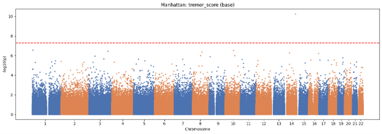

# parkinsons-gwas-analysis

Genome-wide association analyses of cognitive impairment, tremor severity, and Parkinson's disease risk using Hail.

## Overview

This repository contains genome-wide association study (GWAS) workflows developed for investigating the genetic architecture of Parkinson's disease, with a focus on:

- Tremor severity
- Cognitive impairment
- Parkinson's disease susceptibility

The workflow performs discovery GWAS, model comparison, cross-trait validation, independent locus definition, and post-GWAS characterization.

## Scientific Objectives

1. Identify variants associated with tremor severity and cognitive impairment in Parkinson's disease.
2. Distinguish motor-specific, cognitive-specific, and shared genetic effects.
3. Quantify genomic inflation and model performance.
4. Validate Parkinson's disease severity signals against large case-control datasets.
5. Evaluate overlap between cognitive impairment biology and Parkinson's disease risk.
6. Generate summary statistics suitable for downstream analyses including:
   - Polygenic Risk Scores (PRS)
   - LD Score Regression (LDSC)
   - Locus-level analyses
   - Cross-trait genetic comparisons

## Methods

- Hail-based GWAS workflows
- Linear regression GWAS
- Logistic regression GWAS
- Population structure correction using principal components
- Covariate-adjusted phenotype modeling
- Genome-wide significance testing
- Manhattan plots
- QQ plots
- Genomic inflation calculations (λGC)
- Independent locus definition
- Cross-trait locus overlap analyses
- Effect-size correlation analyses
- Validation against external cohorts
- Summary statistic harmonization

## Phenotypes

### Parkinson's Disease Cohort

- tremor_score
- ci_unique_count
- ci_binary

### Case-Control Cohort

- Cognitive impairment
- Parkinson's disease risk

## Outputs

- GWAS summary statistics
- Manhattan plots
- QQ plots
- Model diagnostics
- High-confidence variant reports
- Independent locus tables
- Locus overlap analyses
- Effect-size correlation analyses
- Validation reports

## Software

Key packages used in this workflow include:

- Hail
- pandas
- NumPy
- matplotlib
- SciPy
- gcsfs

## Example Results
 workflows developed for investigating the genetic architecture of Parkinson's disease, with a focus on:

- Tremor severity
- Cognitive impairment
- Parkinson's disease susceptibility

The workflow performs discovery GWAS, model comparison, cross-trait validation, independent locus definition, and post-GWAS characterization.

## Scientific Objectives

1. Identify variants associated with tremor severity and cognitive impairment in Parkinson's disease.
2. Distinguish motor-specific, cognitive-specific, and shared genetic effects.
3. Quantify genomic inflation and model performance.
4. Validate Parkinson's disease severity signals against large case-control datasets.
5. Evaluate overlap between cognitive impairment biology and Parkinson's disease risk.
6. Generate summary statistics suitable for downstream analyses including:
   - Polygenic Risk Scores (PRS)
   - LD Score Regression (LDSC)
   - Locus-level analyses
   - Cross-trait genetic comparisons

## Methods

- Hail-based GWAS workflows
- Linear regression GWAS
- Logistic regression GWAS
- Population structure correction using principal components
- Covariate-adjusted phenotype modeling
- Genome-wide significance testing
- Manhattan plots
- QQ plots
- Genomic inflation calculations (λGC)
- Independent locus definition
- Cross-trait locus overlap analyses
- Effect-size correlation analyses
- Validation against external cohorts
- Summary statistic harmonization

## Phenotypes

### Parkinson's Disease Cohort

- tremor_score
- ci_unique_count
- ci_binary

### Case-Control Cohort

- Cognitive impairment
- Parkinson's disease risk

## Outputs

- GWAS summary statistics
- Manhattan plots
- QQ plots
- Model diagnostics
- High-confidence variant reports
- Independent locus tables
- Locus overlap analyses
- Effect-size correlation analyses
- Validation reports

## Software

Key packages used in this workflow include:

- Hail
- pandas
- NumPy
- matplotlib
- SciPy
- gcsfs

## Example Results

